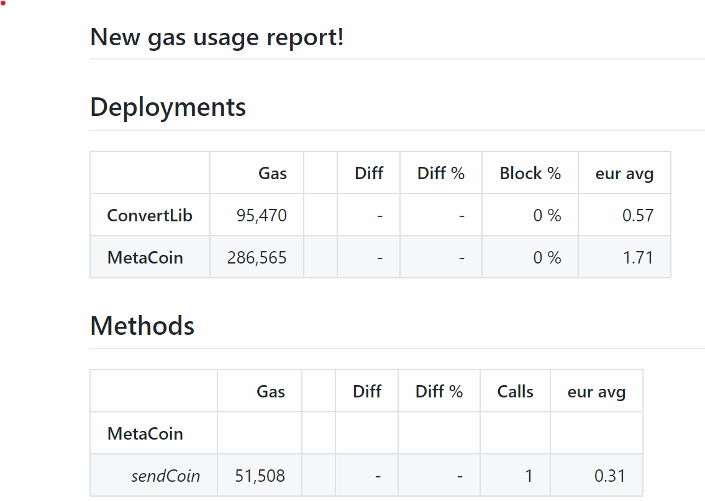

Continuous integration (CI) with Truffle is great for developing once you have a basic set of tests implemented. It allows you to run very long tests, ensure all tests pass before merging a [pull request](https://help.github.com/en/github/collaborating-with-issues-and-pull-requests/creating-a-pull-request) and to keep track of various statistics using additional tools.

We will use the [Truffle Metacoin Box](https://www.trufflesuite.com/boxes/metacoin) to setup our continuous integration. You can either choose Travis CI or Circle CI.

## Setting up Travis CI {#setting-up-travis-ci}

Adding [Travis CI](https://travis-ci.org/) is straight-forward. You will only need to add a `.travis.yml` config file to the root folder of the project:

```yml
language: node_js
node_js:
  - 10

cache: npm

before_script:
  - echo fs.inotify.max_user_watches=524288 | sudo tee -a /etc/sysctl.conf && sudo sysctl -p

script:
  - npm test
```

We are keeping it simple for now and are only running the test script which executes the Truffle unit tests. But we have one problem, there won't be a blockchain available on the Travis CI machine. A simple fix for this is to `npm install ganache-cli` and simply run it before the test. You can do this by adding a bash script with the line npx `ganache-cli > /dev/null` and before the `npx truffle test` call. The [full example bash script](https://github.com/gorgos/Truffle-CI-Example/blob/master/scripts/run_tests.sh).

## Setting up Circle CI {#setting-up-circle-ci}

[CircleCi](https://circleci.com/) requires a longer config file. The additional [`npm ci`](https://docs.npmjs.com/cli/ci.html) command is automatically done in Travis. It installs dependencies faster and more securely than `npm install` does. We again use the same script from the Travis version to run ganache-cli before the tests.

```yml
version: 2

aliases:
  - &defaults
    docker:
      - image: circleci/node:10

  - &cache_key_node_modules
    key: v1-node_modules-{{ checksum "package-lock.json" }}

jobs:
  dependencies:
    <<: *defaults
    steps:
      - checkout
      - restore_cache:
          <<: *cache_key_node_modules
      - run:
          name: Install npm dependencies
          command: |
            if [ ! -d node_modules ]; then
              npm ci
            fi
      - persist_to_workspace:
          root: .
          paths:
            - node_modules
            - build
      - save_cache:
          paths:
            - node_modules
          <<: *cache_key_node_modules

  test:
    <<: *defaults
    steps:
      - checkout
      - attach_workspace:
          at: .
      - run:
          name: Unit tests
          command: npm test

workflows:
  version: 2
  everything:
    jobs:
      - dependencies
      - test:
          requires:
            - dependencies
```

## Adding the eth-gas-reporter plugin {#adding-the-eth-gas-reporter-plugin}

The eth-gas-reporter plugin is quite useful for keeping track of the gas costs of your smart contract functions. Having it in your CI will further be useful for showing diffs when adding pull requests.

### Step 1: Install the eth-gas-reporter plugin and codechecks {#step-1-install-the-eth-gas-reporter-plugin-and-codechecks}

```bash
$ npm install --save-dev eth-gas-reporter
$ npm install --save-dev @codechecks/client
```

### Step 2: Add the plugin to the mocha settings inside your truffle-config.js {#step-2-add-the-plugin-to-the-mocha-settings-inside-your-truffle-configjs}

[See options](https://github.com/cgewecke/eth-gas-reporter#options)

```js
module.exports = {
  networks: { ... },
  mocha: {
    reporter: 'eth-gas-reporter',
    reporterOptions: {
      excludeContracts: ['Migrations']
    }
  }
};
```

### Step 3: Add a codechecks.yml to your project's root directory {#step-3-add-a-codechecksyml-to-your-projects-root-directory}

```yml
checks:
  - name: eth-gas-reporter/codechecks
```

### Step 4: Run codechecks after the test command {#step-4-run-codechecks-after-the-test-command}

```bash
- npm test
- npx codechecks
```

### Step 5: Create a Codechecks account {#step-5-create-a-codechecks-account}

- Create an account with [Codechecks](http://codechecks.io/).
- Add the Github repo to it.
- Copy the secret and add the `CC_SECRET=COPIED SECRET` to your CI (see here for [Travis](https://docs.travis-ci.com/user/environment-variables/), here for [CircleCi](https://circleci.com/docs/2.0/env-vars/#setting-an-environment-variable-in-a-project)).
- Now go ahead and create a pull request.

That's it. You will now find a nice report about changes in gas costs of your pull request.



## Adding the solidity-coverage plugin {#adding-the-solidity-coverage-plugin}

With the solidity-coverage plugin you can check how much of your code paths are covered by your tests. Adding this to your CI makes is very convenient to use once it is set up.

### Step 1: Create a metacoin project and install coverage tools {#step-1-create-a-metacoin-project-and-install-coverage-tools}

```bash
$ npm install --save-dev truffle
$ npm install --save-dev coveralls
$ npm install --save-dev solidity-coverage
```

### Step 2: Add solidity-coverage to the plugins array in truffle-config.js {#step-2-add-solidity-coverage-to-the-plugins-array-in-truffle-configjs}

```js
module.exports = {
  networks: {...},
  plugins: ["solidity-coverage"]
}
```

### Step 3: Add the coverage commands to the .travis.yml or Circle CI config.yml {#step-3-add-the-coverage-commands-to-the-travisyml-or-circle-ci-configyml}

```bash
- npx truffle run coverage
- cat coverage/lcov.info | npx coveralls
```

Solidity coverage starts its own ganache-cli, so we don't have to worry about this. Do not replace the regular test command though, coverage's ganache-cli works differently and is therefore no replacement for running regular unit tests.

### Step 4: Add repository to coveralls {#step-4-add-repository-to-coveralls}

- Create an account with [Coveralls](https://coveralls.io/).
- Add the Github repo to it.
- Now go ahead and create a pull request.


## Further ideas {#further-ideas}

- [MythX](https://mythx.io/): With MythX you can automatically analyze your smart contract security. So it makes a lot of sense to [add this to your CI](https://blog.mythx.io/howto/mythx-and-continuous-integration-part-1-circleci/).
- [Linting](https://en.wikipedia.org/wiki/Lint_%28software%29): Good code can be enforced to some degree with linting tools. [Eslint](https://eslint.org/) works great for Javascript, is [easy to setup](https://eslint.org/docs/user-guide/getting-started), while [Solhint](https://protofire.github.io/solhint/) can be used for Solidity.
- Long tests: Sometimes you may want to add extreme tests, e.g., testing a contracts with hundreds of users. This takes a lot of time. Instead of running those in every test run, add them to the CI.

There you have it. Continuous integration is a very useful strategy for your developments. You can check out a full example at [Truffle-CI-Example](https://github.com/gorgos/Truffle-CI-Example). Just make sure to remove Circle-CI or Travis, one is enough!
